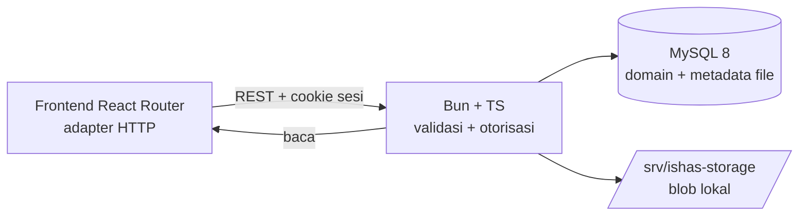

# Backend ISHAS — Gambaran Umum

Status: **rancangan** (frontend tetap sumber kebenaran perilaku sampai backend hidup).
Keputusan stack: **D-30** di `DECISIONS.md`. Target baca: pemilik + pelaksana backend.

## 1. Stack yang disepakati

| Lapisan | Pilihan | Alasan |
|---|---|---|
| Runtime + bahasa | Bun + TypeScript | Serumpun dengan frontend (`bun 1.4`), cepat, satu bahasa |
| Database | MySQL 8 (`utf8mb4`) | Keputusan pemilik; umum untuk hibah kampus |
| File | Storage **lokal** (disk service) | S3 belum butuh; lihat `BACKEND_STORAGE.md` |
| Auth | **Ditunda fase akhir** | Login kartu dummy tetap dipakai sampai semua modul matang |
| PDF | Data dari server, render tetap browser dulu | Generator PDF server opsional tahap lanjut |

Yang **bukan** bagian MVP backend: S3/object storage, PDF server-side,
realtime/websocket, email/notifikasi push, pencarian full-text khusus.

## 2. Arsitektur

- Satu service API (monolit modular per domain). Tanpa microservice.
- Frontend menukar `mock-repository.ts` menjadi klien HTTP dengan
  **antarmuka yang sama** (lihat `BACKEND_MIGRATION.md`); UI tidak ditulis ulang.
- Semua aturan validasi dan guard peran di-port 1:1 dari mock
  (lihat `BACKEND_API_CONTRACT.md`). Guard frontend tetap ada sebagai UX,
  **otorisasi nyata di backend**.

## 3. Prinsip yang tidak boleh dilanggar

1. ID stabil frontend dipertahankan (`RPT-`, `REC-`, `RSK-`, `SAM-`, `SMF-`,
   `DOC-`, `CAMPUS-`, `IND-K3L-`, `SAM-KAT-`, `SAM-Q-`, asset `*-asset-<uuid>`).
2. `Menunggu validasi`/`Ditolak` tidak pernah keluar lewat endpoint publik.
3. `Completed` tidak tampil publik; arsip (`archivedAt`) bukan hapus.
4. `severity/priority` tanpa default; rekomendasi final lapor-cepat wajib (D-29).
5. Snapshot penilaian beku: tidak dihitung ulang saat bank berubah (D-24).
6. Blob privat tidak pernah disajikan ke publik (D-02 + D-27 untuk foto PDF).
7. Setiap mutasi menulis audit; notifikasi hanya ke pemilik scope.
8. Rumus/skor agregat tetap **asumsi prototipe** sampai penelitian final (D-04).

## 4. Struktur dokumen backend

| File | Isi |
|---|---|
| `BACKEND_OVERVIEW.md` | File ini: stack, arsitektur, prinsip, fase |
| `BACKEND_DATA_MODEL.md` | Tabel MySQL per entitas + DDL + indeks + seed demo/kosong |
| `BACKEND_API_CONTRACT.md` | Endpoint REST + matriks otorisasi + validasi + efek |
| `BACKEND_STORAGE.md` | File lokal: tabel, direktori, validasi, serving, yatim |
| `BACKEND_MIGRATION.md` | Tahapan migrasi mock → backend + swap adapter + uji |
| `BACKEND_ISSUES.md` | Daftar issue GitHub + perintah `gh` siap jalan |

## 5. Fase pengerjaan

| Fase | Isi | Catatan |
|---|---|---|
| 0 | Fondasi: proyek Bun+TS, koneksi MySQL, migrasi schema v15, seed demo + kosong | ID stabil, `counters` aman |
| 1 | Domain baca publik + lapor + penilaian-mandiri (termasuk bukti D-27, rekomendasi D-29) | Tanpa login untuk baca/kirim, seperti sekarang |
| 2 | Validasi Pesantren + lifecycle + arsip + lokasi/denah + tindak lanjut | Scope per lembaga |
| 3 | Bank instrumen live + checksum + snapshot + dokumen PDF + dataset/impor D-25 | Validator-only |
| 4 | SAM-iSAFE + bank + fase 2 (bukti, tindak lanjut, tren, review) | Validator-only |
| 5 | Admin (pesantren/user) + audit + notifikasi + storage file lokal penuh | Menggantikan IndexedDB |
| 6 | **Auth (terakhir)**: hash sandi + sesi server + RBAC penuh | Baru setelah fase 0–5 matang |

Setiap fase selesai bila: endpoint hidup + validasi 1:1 mock + test +
adapter frontend bisa beralih + `TODO.md` dicentang.
