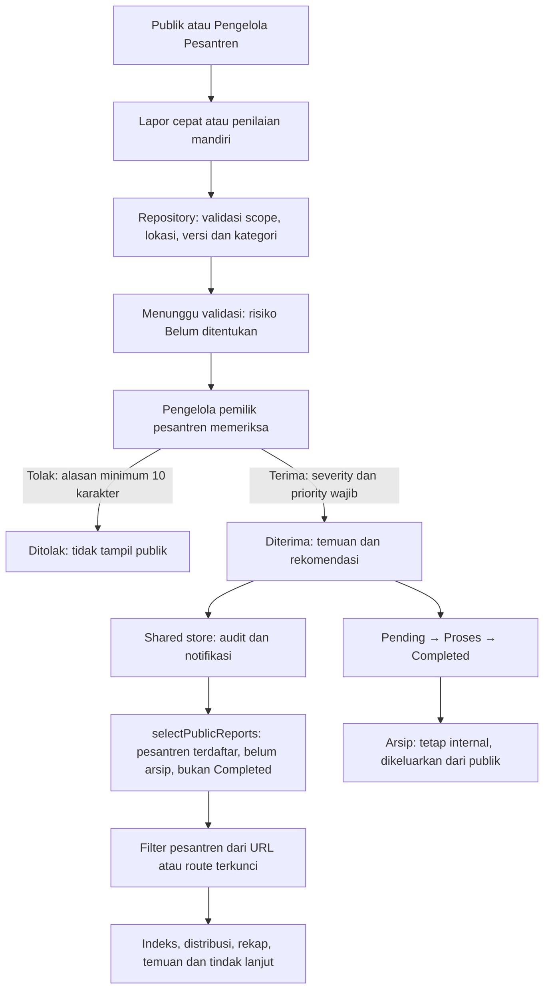

# Alur data dashboard publik — kontrak penyempurnaan

Acuan: D-02/D-03 (akses), D-04 (skor ilustratif), D-07/D-08 (arsip dan
pesantren terdaftar), D-14 (peta), D-15 (kategori), D-13 amendemen penyempurnaan.
Tema dan token warna tetap. Prototipe frontend memakai schema v6; backend belum ada.

## Dari pelaporan ke dashboard

Sesi login tidak mengubah dataset publik. Pengelola boleh memoderasi laporannya
sendiri (D-06); audit membedakan pengirim dan validator. Mutasi lintas halaman
melalui repository/store, bukan state lokal. Blob bukti/denah berada di IndexedDB;
record/draft menyimpan ID, bukan file server atau kredensial produksi.

## Dataset dan unit angka

| Panel | Dataset | Unit / batas |
|---|---|---|
| Indeks dan dimensi | Snapshot terbaru Diterima per pesantren | Normalisasi D-04; rata-rata bobot sama per lembaga, bukan semua kiriman |
| Jawaban diharapkan/terisi | Semua snapshot milik laporan publik pada scope | Slot jawaban lintas kiriman/versi; bukan katalog indikator unik dan bukan denominator indeks |
| Penilaian diterima | Snapshot milik laporan publik | Jumlah kiriman penilaian, berbeda dari jumlah pesantren |
| Katalog kategori | Indikator unik instrumen Published | Draft/Archived tidak menambah katalog; tidak berubah saat filter pesantren |
| Sesuai/tidak sesuai | Jawaban snapshot laporan publik | Definisi tipe/kategori dari versi snapshot asal; kosong/N/A/nilai di luar skala tidak diklasifikasi |
| Distribusi risiko/kategori/lokasi | Temuan terkait laporan publik | Satu record temuan; jumlah per kategori dan per lokasi sama dengan donat |
| Risiko tinggi / ekstrem | Temuan Tinggi atau Ekstrem belum Terverifikasi | Subset aktif; tidak wajib sama dengan penjumlahan seluruh kategori donat |
| Kanal dan aktivitas | Laporan publik | Jumlah kiriman; aktivitas berdasarkan createdAt, bukan tanggal validasi |
| Status/progres tindak lanjut | Rekomendasi terkait laporan publik | Jumlah pekerjaan; progres rata-rata, null bila kosong |
| Peta | Proyeksi publik temuan/lokasi | Satu pesantren; pin asli per versi denah, tanpa titik centroid otomatis |

Rekap lokasi memakai areaId stabil; nama area sama pada dua pesantren tidak
digabung. Scope agregat menampilkan kode pesantren untuk membedakan area.
`Belum dipetakan` menampung laporan tanpa kategori, bukan ditebak dari judul.
Sesuai pada rekap adalah klasifikasi ilustratif pemicu temuan; bukan sertifikasi.

### Data legacy yang tidak diklasifikasi

Seed RPT-0007 / IND-K3L-002 memiliki nilai `3` pada tipe `likert-1-2-tidak`.
Snapshot historis dipertahankan; nilai itu tidak dihitung sebagai Sesuai maupun
Tidak sesuai. Seed memiliki 32 jawaban terisi dan 31 jawaban yang diklasifikasi.
Indeks tetap memakai normalisasi ilustratif D-04 yang ada; revisi ini tidak
mengubah rumus atau menulis ulang hasil lama. Perbedaan denominator dijelaskan
pada panel dan kontrak ini.

## Konteks URL dan periode

- `?pesantren=` memfilter seluruh dataset operasional publik; route
  `/pesantren/:kode` mengunci scope, termasuk tautan tindak lanjut.
- Ganti pesantren membersihkan denah/risiko/statusPeta yang bergantung pada scope.
  Tautan publik mempertahankan pesantren dan periode; Back/Forward membaca URL.
- `?periode=` masih pratinjau konteks sesuai D-04. Belum memfilter angka operasional
  maupun peta aktif. Banner angka menyebut periode berjalan; periode berbeda
  mendapat notice. Jangan mengklaim semua metrik terfilter periode.
- Riwayat indeks seed adalah ilustrasi; bukan rekonstruksi laporan masa lalu.
- Denah/risiko/statusPeta hanya memfilter panel peta, bukan seluruh dashboard.

## Batas publik dan visualisasi

Publik hanya ringkasan, lokasi yang diizinkan, nama validator/PIC. Nama/kontak
pelapor, bukti, jawaban mentah, nomor laporan, audit, dan tenggat internal tidak
diproyeksikan ke UI publik. Denah gambaran besar mengikuti amendemen D-14.

Batang memakai rasio nilai terhadap maksimum tanpa tinggi minimum semu; nol
memiliki panjang nol. Grafik kategori memakai batang horizontal dengan label
lengkap di ponsel dan SVG dengan baseline tetap di layar lebih lebar. Donat
menampilkan total, label, nilai, dan persentase pembulatan (jumlah persentase dapat
berbeda dari 100%). Tabel 9 kolom tetap tabel dengan scroll lokal, kolom kategori
sticky, dan baris total. Kartu kategori berasal dari K3_CATEGORIES bersama.

## Penelusuran dan verifikasi

Selector: `apps/web/mocks/store/selectors.ts`; processor:
`apps/web/mocks/processors/dashboard-aggregate.ts`; seed/versi dan kategori di
`apps/web/mocks/seed/seed.ts` dan `apps/web/mocks/kategori-k3.ts`.
Hasil uji baru dicatat di `planning/STAGE_DASHBOARD_POLISH.md`. Pemeriksaan lama
pada stage lain tidak otomatis membuktikan revisi atau alur E2E terbaru.
