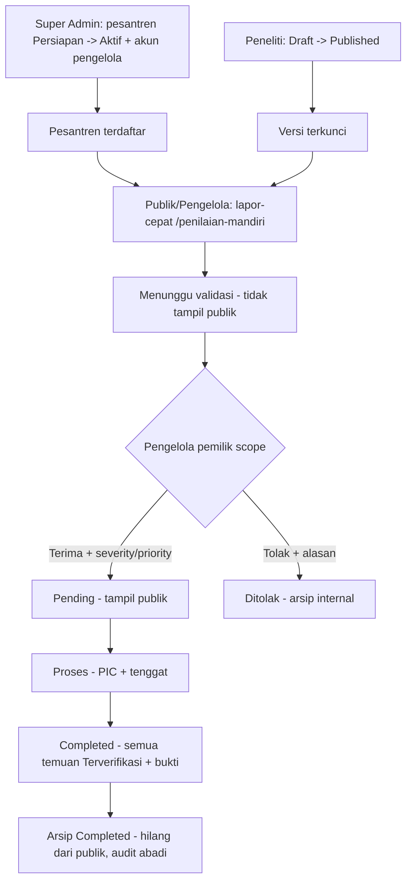

# Flow ISHAS (Aplikasi Aktif)

Dokumen ini menjelaskan alur operasional **aplikasi aktif** di `apps/web/`
(React Router + bun, paket `ishas`). Sumber kebenaran: `docs/` +
implementasi `apps/web/`. Semua angka/skor adalah **data dummy ilustratif**,
bukan ketentuan ilmiah final.

> Cara baca: tiap langkah memakai pola **Aktor → aksi UI → hasil sistem →
> jejak (audit/notifikasi)**. Rujukan `file:line` menunjuk ke implementasi aktif,
> bukan ke dokumen rencana.

## 0. Ringkasan eksekutif

1. Publik atau Pengelola mengirim **lapor-cepat** (`/lapor`) atau
 **penilaian-mandiri** (`/penilaian-mandiri`).
2. Kiriman berstatus `Menunggu validasi`, **tidak tampil publik**.
3. Pengelola pemilik scope **Terima** (wajib severity + priority) atau
 **Tolak** (wajib alasan min 10) di `/pengelola/validasi-laporan`.
4. Diterima → `Pending → Proses → Completed → arsip`.
5. Publik (`/`, `/hasil`, `/peta-risiko`, `/rekomendasi`, `/tindak-lanjut`,
 `/laporan`) hanya membaca data `Diterima` + belum diarsip.
6. Peneliti mengelola siklus instrumen Published → sumber soal mandiri.
7. Super Admin mengelola pesantren + akun pengelola + audit + reset demo.

Diagram utama (tanpa Asesor):



## 1. Istilah dan peran baku

- `Super Admin`, `Pengelola Pesantren (mitra)`, `Peneliti`, `Publik / Pelapor`.
- `Pesantren terdaftar` = status `Aktif` DAN punya tepat-satu pengelola `Aktif`
 per definisi kode `apps/web/mocks/store/selectors.ts:12`.
- Kanal laporan: `lapor-cepat`, `penilaian-mandiri`
 (`apps/web/mocks/types.ts:7`).
- Status validasi: `Menunggu validasi | Diterima | Ditolak`.
- Status penanganan: `Menunggu validasi | Pending | Proses | Completed | Ditolak`
 (`apps/web/mocks/types.ts:11`). `Dihapus` bukan nilai tersimpan.
- Severity/Priority: `Belum ditentukan | Tinggi | Sedang | Rendah`.
 `Belum ditentukan` = belum diisi pengelola, bukan nilai netral publik.
- Dilarang di alur aktif: asesor, penugasan, Assessment Saya, empat peran,
 finalisasi laporan (gantinya: `kirim untuk validasi`).

Akun demo persis (`apps/web/mocks/seed/demo-accounts.ts:18`,
`apps/web/mocks/seed/seed.ts:48`):

| Peran | Email | Scope |
|---|---|---|
| Super Admin | `admin@ishas.demo` | Seluruh sistem |
| Peneliti | `peneliti@ishas.demo` | Seluruh sistem |
| Pengelola | `pengelola@ishas.demo` | `PSN-0018` PP Al-Hikmah Malang |
| Pengelola 2 (seed, tanpa kartu login) | `pengelola2@ishas.demo` | `PSN-0019` PP Nurul Iman Batu |

## 2. Peta route aktif

Definisi route `apps/web/app/routes.ts:6`:

Publik (shell ringan, isi sama untuk semua sesi):

| URL | Halaman | Implementasi |
|---|---|---|
| `/` | Dashboard publik agregat + pemilih pesantren | `apps/web/features/publik/pages/dashboard-page.tsx:37` |
| `/lapor` | Laporan cepat satu langkah | `apps/web/features/publik/pages/lapor-page.tsx:51` |
| `/penilaian-mandiri` | Self-assessment instrumen penuh | `apps/web/features/publik/pages/penilaian-mandiri-page.tsx:24` |
| `/hasil` | Hasil per dimensi + sumber tervalidasi | `apps/web/features/publik/pages/public-read-pages.tsx:59` |
| `/peta-risiko` | Daftar Area + Daftar Temuan (tanpa tab Denah publik) | `apps/web/features/publik/pages/public-read-pages.tsx:69` |
| `/rekomendasi` | Rekomendasi + PIC + progres | `apps/web/features/publik/pages/public-read-pages.tsx:75` |
| `/tindak-lanjut` | Tindak lanjut mode baca | `apps/web/features/publik/pages/public-read-pages.tsx:79` |
| `/laporan` | Laporan pimpinan baca publik | `apps/web/features/publik/pages/public-read-pages.tsx:83` |
| `/pesantren/:kode` | Profil ringkas, filter terkunci | `apps/web/features/publik/pages/pesantren-detail-page.tsx` |
| `/login` | 3 kartu akun, tanpa asesor | `apps/web/features/auth/pages/login-page.tsx` |
| `/akses-ditolak` | Pesan + tombol kembali kontekstual | `apps/web/features/auth/pages/akses-ditolak-page.tsx` |
| `/asesor/*` | Pesan penghentian → `/penilaian-mandiri` | `apps/web/features/auth/pages/asesor-deprecated-page.tsx` |

Workspace (wajib login + peran cocok):

| URL | Role | Halaman |
|---|---|---|
| `/admin/dashboard` | admin | Dashboard sistem |
| `/admin/pengguna` | admin | Buat pengelola + status akun (`apps/web/features/admin/pages/users-page.tsx:7`) |
| `/admin/pesantren` | admin | Direktori + Persiapan/Aktif/Nonaktif (`apps/web/features/admin/pages/institutions-page.tsx:1`) |
| `/admin/hak-akses` | admin | Matriks baca |
| `/admin/audit-log` | admin | Jejak global baca |
| `/admin/pengaturan` | admin | Preferensi + reset demo |
| `/peneliti/dashboard` | peneliti | Dashboard penelitian |
| `/peneliti/instrumen` | peneliti | Builder baca (`apps/web/features/peneliti/pages/instrumen-page.tsx:5`) |
| `/peneliti/versioning` | peneliti | Draft/Published/Archived (`apps/web/features/peneliti/pages/versioning-page.tsx:5`) |
| `/peneliti/scoring` | peneliti | Konfigurasi scoring |
| `/peneliti/validasi-publikasi` | peneliti | Checklist + kunci publish |
| `/peneliti/data-penelitian` | peneliti | Dataset snapshot (`apps/web/features/peneliti/pages/data-penelitian-page.tsx:6`) |
| `/pengelola/validasi-laporan` | pengelola | Antrean moderasi = halaman utama (`apps/web/features/pengelola/pages/validasi-laporan-page.tsx:13`) |
| `/pengelola/lokasi` | pengelola | Gedung/area/denah (`apps/web/features/pengelola/pages/lokasi-page.tsx:8`) |
| `/pengelola/tindak-lanjut` | pengelola | Kelola PIC/tenggat/progres/bukti (`apps/web/features/pengelola/pages/tindak-lanjut-page.tsx:8`) |
| `/pengelola/laporan` | pengelola | Laporan scope sendiri (`apps/web/features/pengelola/pages/laporan-page.tsx:7`) |

Tujuan `Ruang kerja` pengelola adalah `/pengelola/validasi-laporan`, bukan
dashboard (`apps/web/shared/auth/access-policy.ts:20`).

## 3. Sesi, guard, storage

- Sesi menunjuk `accountId`, bukan role saja
 (`apps/web/shared/auth/session.ts:7`,
 `apps/web/shared/auth/use-current-user.ts:7`). Kunci `ishas-session-v2`,
 sessionStorage, pulih diam-diam saat refresh.
- Guard workspace `apps/web/shared/auth/access-policy.ts:32`: tanpa sesi →
 `/login` (kembali ke URL tujuan semula bila sesama peran); role salah →
 `/akses-ditolak`. Bukan pengganti otorisasi backend.
- Domain dummy: kunci `ishas-mock-v4`, `schemaVersion: 4`
 (`apps/web/mocks/store/state.ts:8`). Versi tak cocok → seed ulang.
 Reset demo mengembalikan seed; riwayat demo ikut hilang (label demo).
- Draft lapor: localStorage per pesantren + cermin `umum`
 (`apps/web/features/publik/lib/lapor-draft.ts:8`).
- Draft mandiri: state `selfAssessmentDrafts` key `SELF-<kode>`
 (`apps/web/mocks/types.ts:88`).
- Dilarang menyimpan kata sandi/token. Bukti hanya nama file dummy.

## 4. Onboarding pesantren (Super Admin)

Prasyarat: login Super Admin. UI
`apps/web/features/admin/pages/institutions-page.tsx:1`,
`apps/web/features/admin/pages/users-page.tsx:7`.

1. Super Admin → `/admin/pesantren` → Tambah pesantren → isi nama (wajib,
 unik, min 3) + kota/kabupaten (min 3) → sistem buat `PSN-XXXX` status
 `Persiapan` + audit `Membuat data pesantren`
 (`apps/web/mocks/store/mock-store.ts:593`).
2. Verifikasi → `Persiapan → Aktif` eksplisit per baris. Aktivasi **ditolak**
 bila belum ada pengelola aktif
 (`apps/web/mocks/store/mock-store.ts:619`).
3. `/admin/pengguna` → buat Pengelola → nama min 2 + email valid unik +
 tepat 1 pesantren `Aktif` → akun langsung `Aktif` + audit
 (`apps/web/mocks/store/mock-store.ts:573`).
4. Sejak itu pesantren masuk pemilih publik (`selectRegisteredInstitutions`).
 Nonaktif → hilang dari pemilih; lapor baru ditolak
 `Pesantren tidak tersedia untuk pelaporan.`
5. Minimal satu Super Admin harus tetap aktif
 (`apps/web/mocks/store/mock-store.ts:611`).

## 5. Laporan cepat `/lapor`

Prasyarat: ≥1 pesantren terdaftar. Nol → empty state + CTA nonaktif
(`apps/web/features/publik/pages/lapor-page.tsx:138`).

Urutan field tetap
(`apps/web/features/publik/components/lapor-form.tsx:1`):
Nama → Pesantren → Lokasi/area → Judul → Deskripsi → Foto → Kontak.

Aturan validasi ganda (form + store harus sama):

| Field | Aturan | Sumber |
|---|---|---|
| Nama pelapor | Wajib, 2–100 karakter; otomatis dari akun bila pengelola, tetap editable; selalu internal, tidak publik | `apps/web/features/publik/lib/lapor-validation.ts:39`, `apps/web/mocks/store/mock-store.ts:159` |
| Pesantren | Wajib, dropdown terdaftar saja; tanpa isi manual | `apps/web/features/publik/lib/lapor-validation.ts:42`, `apps/web/mocks/store/mock-store.ts:165` |
| Lokasi | `areaId` ATAU `manualLocation` min 3; `areaId` harus milik pesantren itu; tanpa area + tanpa manual → tolak | `apps/web/features/publik/lib/lapor-validation.ts:46`, `apps/web/mocks/store/mock-store.ts:171` |
| Judul | Wajib, 10–140 | `apps/web/features/publik/lib/lapor-validation.ts:54`, `apps/web/mocks/store/mock-store.ts:181` |
| Deskripsi | Wajib, min 20 (apa, di mana, sejak kapan, siapa terdampak) | `apps/web/features/publik/lib/lapor-validation.ts:58`, `apps/web/mocks/store/mock-store.ts:187` |
| Foto | Opsional, nama file dummy | `apps/web/features/publik/components/lapor-form.tsx:216` |
| Kontak | Opsional, maks 100 | `apps/web/features/publik/lib/lapor-validation.ts:62` |

Perilaku kirim (`apps/web/features/publik/pages/lapor-page.tsx:194`):

1. Error inline per field + fokus ke field pertama bermasalah.
2. Draft autosave tiap ketik per pesantren + cermin `umum`; ganti pesantren
 simpan draft lama + muat draft baru; gagal simpan → blokir pindah dengan
 pesan eksplisit.
3. `?pesantren=` tak dikenal/nonaktif → **tidak diganti diam-diam**; tampil
 `Pesantren tidak tersedia untuk pelaporan.` + minta pilih eksplisit.
4. Anti kirim ganda: kunci tombol + `clientRequestId` idempoten; requestId
 sama mengembalikan id lama tanpa record kedua
 (`apps/web/mocks/store/mock-store.ts:109`).
5. Sukses → layar `Laporan terkirim` + `RPT-XXXX` + chip `Menunggu validasi`
 + `Belum tampil di dashboard sebelum divalidasi.`
 (`apps/web/features/publik/components/lapor-success.tsx:19`).
6. Sistem: `validationStatus/handlingStatus: Menunggu validasi`,
 `severity/priority: Belum ditentukan` + audit `Mengirim laporan publik` +
 notifikasi ke tiap pengelola aktif pesantren itu
 (`apps/web/mocks/store/mock-store.ts:219`).
7. Laporan **tidak tampil** di dashboard/hasil/peta/rekomendasi/laporan.

## 6. Penilaian mandiri `/penilaian-mandiri`

Prasyarat: ada versi `Published` aktif. Tanpa itu form terkunci
(`apps/web/features/publik/pages/penilaian-mandiri-page.tsx:55`).

1. Pilih pesantren terdaftar (wajib) + nama pengisi 2–100 (aturan sama lapor).
2. Banner versi terkunci: `Menggunakan [label] · terkunci selama pengisian`;
 pelapor tidak bisa pilih versi.
3. Per indikator (`answerIsComplete`
 `apps/web/features/publik/pages/penilaian-mandiri-page.tsx:14`):
 - jawaban wajib bila `required`;
 - catatan wajib min 10 bila `N/A`;
 - bukti wajib bila `evidenceRequired` (nama file dummy);
 - lokasi wajib bila `locationRequired` (area milik pesantren + titik
 `x/y` 0–100 bila denah tersedia; tanpa denah area saja cukup).
4. Draft `SELF-<kode>` autosave + `activeIndex`; refresh lanjut dari
 indikator terakhir.
5. Tombol `Kirim penilaian` aktif hanya bila identitas + semua indikator
 lengkap; gagal → notice jumlah pertanyaan belum lengkap.
6. Kirim → 1 `Report` kanal `penilaian-mandiri` + 1 `SelfAssessmentSnapshot`
 permanen + audit `Mengirim penilaian mandiri` + notifikasi pemilik scope
 (`apps/web/mocks/store/mock-store.ts:506`, `apps/web/mocks/types.ts:81`).
 Draft dihapus setelah kirim. Status awal `Menunggu validasi`, tidak tampil
 publik.

## 7. Validasi pengelola `/pengelola/validasi-laporan`

Prasyarat: login pengelola 1 scope. Antrean hanya `institutionCode`
miliknya, terbaru dulu
(`apps/web/features/pengelola/pages/validasi-laporan-page.tsx:20`).

1. Buka item → baca nomor, kanal, pelapor internal, lokasi, judul,
 deskripsi, bukti dummy, waktu kirim (+ versi instrumen untuk mandiri).
2. Keputusan A — Terima: wajib `severity` + `priority` eksplisit, tanpa
 default; opsi `Belum ditentukan` ditolak sistem → hasil
 `Diterima/Pending` + `validatedBy/validatedAt` + audit `Memvalidasi
 laporan` (`apps/web/mocks/store/mock-store.ts:240`).
3. Keputusan B — Tolak: wajib alasan min 10 → hasil `Ditolak` terminal +
 validator/waktu/alasan + audit (`apps/web/mocks/store/mock-store.ts:276`).
 Arsip hanya di antrean pemilik scope via filter `Ditolak`.
4. Larangan: pengelola dilarang mengubah isi/bukti/jawaban pelapor. Koreksi
 faktual lewat laporan baru.
5. Boleh moderasi laporan sendiri (D-06 diputus); audit mencatat pengirim dan
 validator terpisah walau akun sama.

## 8. Lifecycle penanganan

Satu-satunya diagram sah (`docs/FLOWS.md:79`,
`apps/web/mocks/store/mock-store.ts:304`):

```
Menunggu validasi → Ditolak (terminal)
Menunggu validasi → Pending → Proses → Completed → arsip (terminal teraudit)
Proses → Pending (mundur + alasan min 10)
Completed → Proses (buka kembali + alasan min 10)
```

| Transisi | Syarat kode |
|---|---|
| Terima → `Pending` | severity + priority terisi (`acceptReport`) |
| Tolak → `Ditolak` | alasan min 10 (`rejectReport`) |
| `Pending → Proses` | PIC min 2 + tenggat ≥ hari ini + catatan rencana |
| `Proses → Completed` | semua temuan `Terverifikasi` + progres 100 + bukti + catatan |
| Mundur | alasan min 10 + audit `Mengembalikan status` |
| `Completed → arsip` | dialog + alasan min 5; set `archivedAt/archivedReason`; audit abadi; hilang dari publik (`deleteCompletedReport`) |

D-05 dan D-07 sudah diputus: satu laporan `Completed` hanya bila seluruh
temuan selesai; `Completed` = arsip, bukan hapus permanen.

## 9. Tindak lanjut dan lokasi

Tindak lanjut (`apps/web/mocks/store/mock-store.ts:469`,
`apps/web/features/pengelola/pages/tindak-lanjut-page.tsx:8`):

1. Dari rekomendasi `Belum ditindaklanjuti` → isi PIC + tenggat + catatan →
 `Berjalan`; laporan induk → `Proses`.
2. Update progres 0–100 + catatan wajib; progres 100 wajib bukti →
 `Menunggu verifikasi`.
3. `verifyFinding` hanya saat laporan `Proses` + catatan wajib; verifikasi
 rekomendasi set temuan terkait `Terverifikasi`.
4. Semua rekomendasi laporan `Terverifikasi` → laporan `Completed`.

Lokasi (`apps/web/mocks/store/mock-store.ts:428`,
`apps/web/features/pengelola/pages/lokasi-page.tsx:8`):

1. Tambah gedung: kode unik per lembaga (case-insensitive) + nama min 2;
 otomatis buat Lantai 1.
2. Tambah lantai: nama unik per gedung, min 2.
3. Tambah area: lantai + nama + zona wajib; langsung muncul di dropdown lapor
 pesantren sama.
4. Denah: simpan nama file dummy sebagai `DENAH-vN` + `planHistory`;
 observasi lama tetap merujuk versi saat observasi; versi baru tidak
 memindahkan titik historis (`apps/web/mocks/types.ts:153`).

## 10. Dashboard dan halaman baca publik

Prinsip: baca publik = `selectValidatedReports` + temuan/rekomendasi
turunannya (`apps/web/mocks/store/selectors.ts:31`).

- `/` agregat lintas terdaftar + pemilih pesantren; sesi login tidak mengubah
 isi, hanya header (`Masuk` → `Ruang kerja` + identitas).
- `?pesantren=` valid → filter semua angka/grafik/temuan; tak valid di halaman
 baca → fallback semua + notice; di form kirim → tolak eksplisit.
- `/pesantren/[kode tak dikenal]` → empty state, bukan crash.
- Indeks ilustrasi D-04 (`apps/web/mocks/processors/dashboard-aggregate.ts:1`):
 sumber skor **hanya** snapshot mandiri `Diterima` terbaru per pesantren;
 lapor-cepat bukan sumber skor; likert 1–5 → 20–100, `Ya`=100, `Tidak`=20,
 kosong/N/A dilewati; indeks semua = rata-rata per lembaga; tren =
 `indexHistory` + titik `Sep 2026` hitung; selalu label periode + versi +
 `Data ilustrasi`.
- `/peta-risiko` publik = Daftar Area + Daftar Temuan; area tanpa temuan aktif
 netral, bukan hijau aman.
- Matriks D-02: publik boleh ringkasan + severity/priority + status/progres +
 nama validator/PIC + periode/versi; publik tidak boleh nama/kontak pelapor,
 bukti, denah rinci + titik, jawaban mentah, alasan tolak, tenggat/catatan
 internal, audit. Count antrean tidak publik.

## 11. Siklus peneliti dan admin baca

- Instrumen baca dimensi/indikator + aturan wajib
 (`apps/web/features/peneliti/pages/instrumen-page.tsx:5`).
- Versioning: buat Draft dari aktif (clone snapshot) → publish arsipkan lama →
 jadi sumber mandiri (`apps/web/mocks/store/mock-store.ts:627`).
 Published dikunci; perubahan lewat versi baru.
- Data penelitian: katalog snapshot mandiri + provenance + status validasi
 (`apps/web/features/peneliti/pages/data-penelitian-page.tsx:6`).
- Laporan pengelola: scope sendiri + dimensi + status + simulasi unduh dummy
 (`apps/web/features/pengelola/pages/laporan-page.tsx:7`).
- Admin: audit global baca + reset demo + matriks hak akses baca.

## 12. Seed demo siap pakai

`apps/web/mocks/seed/seed.ts:12`: 3 `Aktif` + 1 `Persiapan`; terdaftar efektif
2 (`PSN-0018`, `PSN-0019`); `PSN-0020` Aktif tanpa pengelola = kasus negatif;
`RPT-0001/0002` menunggu; `RPT-0003/0004/0007` diterima lintas
Pending/Proses; `RPT-0005` Completed; `RPT-0006` Ditolak; `INS-v1.0`
Published 6 indikator; gedung/area/denah untuk demo; `indexHistory` 5 periode.

## 13. Flow dan logic yang belum beres

> Label: **[FLOW]** = alur/produk belum diputus atau belum konsisten;
> **[LOGIC]** = kode aktif belum menegakkan / belum lengkap. Semua sudah
> diverifikasi di file yang dirujuk.

### A. Dokumen dan keputusan

1. **[SELESAI] Arsip `flow.md` lama sudah dihapus.** File ini adalah dokumentasi utama yang berlaku.
2. **[FLOW] `docs/FLOWS.md` belum sinkron dengan `docs/DECISIONS.md:215`.**
 D-05/D-06/D-07/D-08/D-09/D-10/D-11 sudah DISETUJUI 9 Sep 2026, tetapi
 `FLOWS.md`, `DATA_MODEL.md`, `TODO.md`, dan planning masih menuliskannya
 sebagai terbuka/menunggu. Sinkronisasi tertunda.
3. **[FLOW] `apps/web/FLOW.md:1` hanya 7 baris.** Tidak mencakup validasi
 field, transisi, scope, D-02, agregat ilustrasi, storage, dan edge case.
 File ini adalah panduan detail operasional; ringkasan 5 langkah ada di `apps/web/FLOW.md`.

### B. Pembentukan temuan dari kiriman baru

4. **[LOGIC] `submitSelfAssessment` tidak membentuk temuan/rekomendasi.**
 `apps/web/mocks/store/mock-store.ts:506` hanya membuat `Report` +
 `SelfAssessmentSnapshot` + audit + notifikasi. Seed punya
 `RSK-/REC-` untuk `RPT-0003/0004/0005/0007`, tetapi kiriman mandiri baru
 tidak punya turunan sehingga tidak muncul di peta/rekomendasi sampai ada
 processor pembentuk kandidat temuan. Flow §peta/rekomendasi untuk data baru
 terputus di sini.
5. **[FLOW] Aturan pemicu temuan belum final.** `findingTrigger` (`1`, `Tidak`)
 hanya contoh seed ilustratif (`apps/web/mocks/seed/seed.ts:474`), bukan
 aturan universal. Jangan anggap semua `Tidak`/skor rendah = bahaya.

### C. Validasi dan lokasi laporan

6. **[LOGIC] Self-assessment belum dukung lokasi manual D-11.**
 Lapor punya `manualLocation` (`apps/web/mocks/types.ts:55`,
 `apps/web/mocks/store/mock-store.ts:127`), tetapi
 `submitSelfAssessment` menolak bila `locationRequired` tanpa `areaId`
 (`apps/web/mocks/store/mock-store.ts:519`). Inkonsisten dengan putusan
 D-11: lokasi tidak boleh kosong, boleh deskripsi manual bila area tak ada.
7. **[FLOW] Kebijakan tanpa area belum konsisten ujung-ke-ujung.**
 Lapor memblokir kirim bila area kosong (`selectedHasNoAreas`), D-11
 membolehkan manual. Seed lokasi hanya lengkap untuk demo tertentu; pesantren
 baru tanpa area akan mentok di form mandiri.

### D. Hak kirim dan boundary data

8. **[LOGIC] `submitSelfAssessment` tidak memeriksa peran pengirim.**
 `submitPublicReport` menolak admin/peneliti
 (`apps/web/mocks/store/mock-store.ts:133`), tetapi
 `submitSelfAssessment` tidak memeriksa `actor.roleId`
 (`apps/web/mocks/store/mock-store.ts:506`). Penegakan D-03 di kanal
 mandiri hanya di UI (`blocked`
 `apps/web/features/publik/pages/penilaian-mandiri-page.tsx:35`), sehingga
 panggilan adapter langsung bisa lolos. Perlu pemeriksaan sama di boundary
 data.
9. **[LOGIC] `saveSelfAssessmentDraft` tanpa validasi scope/versi.**
 `apps/web/mocks/store/mock-store.ts:496` menyimpan draft apa adanya; tidak
 menolak pesantren tak terdaftar atau versi non-Published. UI menutupnya,
 store tidak.

### E. Moderasi dan konkurensi

10. **[LOGIC] Detail validasi belum tampilkan jawaban per indikator.**
 `docs/FLOWS.md:68` meminta pengelola membaca seluruh jawaban mandiri
 hanya-baca, tetapi modal `Review`
 (`apps/web/features/pengelola/pages/validasi-laporan-page.tsx:26`) hanya
 tampilkan judul/deskripsi/bukti/lokasi. Validasi mandiri tanpa melihat
 snapshot tidak lengkap.
11. **[LOGIC] Tidak ada deteksi keputusan ganda.**
 Dua pengelola/brwsr membuka item sama bisa menimpa tanpa deteksi versi;
 `acceptReport/rejectReport` hanya cek status saat tulis
 (`apps/web/mocks/store/mock-store.ts:240`). Skenario U-05 belum tertutup.
12. **[FLOW] Riwayat keputusan belum eksplisit di UI.**
 Audit ada, tetapi antrean tidak menampilkan linimasa terima/tolak/mundur/
 buka-kembali per laporan.

### F. Dua jalur PIC/tenggat belum satu aturan

13. **[LOGIC] `updateHandlingStatus` vs `updateRecommendation` bisa beda jalan.**
 Jalur rekomendasi dari `Belum ditindaklanjuti` langsung set laporan
 `Proses` (`apps/web/mocks/store/mock-store.ts:480`) tanpa melewati syarat
 `Pending → Proses` yang sama persis (catatan rencana + cek tenggat masa
 lalu). Sinkronisasi kedua jalur belum eksplisit; flow §8/§9 harus
 menetapkan satu sumber syarat.

### G. Periode, agregat, tren

14. **[LOGIC] Periode hardcode `Sep 2026`.**
 `PERIODE_BERJALAN` (`apps/web/mocks/processors/dashboard-aggregate.ts:19`)
 ilustratif; `?periode=` belum fungsional. Aturan periode observasi vs
 waktu kirim menunggu D-04 final.
15. **[FLOW] Agregat ilustrasi belum boleh dibaca sebagai rumus.**
 Satu snapshot terbaru per pesantren + rata-rata per lembaga + tren
 `indexHistory` adalah asumsi seed (`docs/DECISIONS.md:102`), bukan
 rumus resmi. Setiap angka wajib label kategori + periode + versi + status
 data.

### H. Akun, pesantren nonaktif, sesi

16. **[LOGIC] Aktivasi `Menunggu → Aktif` tidak ada UI.**
 `FLOWS.md` §1 meminta akun `Menunggu`, tetapi UI admin langsung buat
 `Aktif` (`apps/web/features/admin/pages/users-page.tsx:10`). Alur
 aktivasi belum beres.
17. **[LOGIC] Pengelola kedua tanpa kartu login.**
 `USR-004` ada untuk isolasi scope, tetapi `DEMO_ACCOUNTS` hanya 3 kartu
 (`apps/web/mocks/seed/demo-accounts.ts:18`). Demo dua pengelola belum bisa
 login tanpa utak-atik data (D-09 UI tertunda).
18. **[FLOW] Edge Nonaktif/kehilangan pengelola terakhir belum lengkap.**
 Form menolak kiriman baru, tetapi perilaku sesi aktif, draft terbuka,
 antrean pending, dan pekerjaan berjalan mengikuti D-08 yang sinkronisasinya
 tertunda di `FLOWS.md`.
19. **[FLOW] Draft lintas akun/perangkat belum final.**
 Draft lapor interim tetap ada setelah logout/ganti akun
 (`apps/web/features/publik/lib/lapor-draft.ts:1`); draft mandiri per
 perangkat. Kepemilikan di perangkat bersama + penyimpanan penuh/rusak +
 jumlah draft menunggu D-10 final.

### I. Publik vs internal dan query param

20. **[FLOW] Perilaku kode tak dikenal beda antara baca vs kirim.**
 Halaman baca fallback ke semua + notice
 (`apps/web/features/publik/pages/public-read-pages.tsx:48`), form kirim
 menolak eksplisit
 (`apps/web/features/publik/pages/lapor-page.tsx:69`). Benar secara produk,
 tetapi belum ada di flow lama; harus didokumentasikan agar tidak dikira
 bug.
21. **[FLOW] Notifikasi ke pelapor belum ada.**
 Notifikasi hanya ke pemilik scope
 (`apps/web/mocks/store/mock-store.ts:675`); status untuk pelapor login
 masih usulan, pelacakan publik pakai nomor saja bukan bukti kepemilikan.
22. **[LOGIC] Nama fungsi arsip menyesatkan.**
 `deleteCompletedReport` sebenarnya mengarsip (`archivedAt`), bukan hapus
 (`apps/web/mocks/store/mock-store.ts:372`). Sesuai D-07, tetapi nama +
 pesan UI harus konsisten kata `arsip`, bukan `hapus`.
23. **[LOGIC] Seed mengandung teks `Anonim — Warga Sekitar` (`RPT-0006`).**
 D-02 melarang opsi anonim; teks bebas boleh berisi kata itu sehingga
 membingungkan. Sebaiknya ganti contoh nama kelompok yang jelas bukan opsi
 anonimitas.

### J. Data warisan dan unduh

24. **[LOGIC] Field field lama (tidak dipakai sebagai status resmi) masih di tipe/seed.**
 `Institution.assessment` (`Belum dimulai | Berjalan | Draft | Selesai`)
 (`apps/web/mocks/types.ts:29`, `apps/web/mocks/seed/seed.ts:20`) belum
 dipetakan ke hasil/periode (D-04). Jangan dipakai sebagai status resmi.
25. **[FLOW] Unduh PDF/Excel, email, upload nyata belum ada.**
 Tombol unduh hanya alert simulasi
 (`apps/web/features/pengelola/pages/laporan-page.tsx:11`,
 `apps/web/features/publik/pages/public-read-pages.tsx:86`); bukti hanya
 nama file; undangan email tidak dikirim. Semua di luar prototipe.

## 14. Checklist demo (pengganti checklist lama)

- [ ] Super Admin tambah pesantren `Persiapan` → aktifkan setelah pengelola ada.
- [ ] Super Admin buat pengelola + hubungkan 1 pesantren aktif.
- [ ] Peneliti publish versi; mandiri terkunci ke versi itu.
- [ ] Pengelola tambah gedung/lantai/area; area muncul di form lapor.
- [ ] Publik kirim lapor → `RPT-XXXX` + `Menunggu validasi`, tidak tampil publik.
- [ ] Publik kirim mandiri lengkap → snapshot tersimpan, tidak tampil publik.
- [ ] Pengelola terima dengan severity + priority → tampil publik.
- [ ] Pengelola tolak dengan alasan → arsip internal saja.
- [ ] `Pending → Proses` dengan PIC/tenggat/catatan.
- [ ] Selesaikan semua temuan + bukti → `Completed` → arsip → hilang publik.
- [ ] Dashboard/hasil/peta/rekomendasi/laporan hanya baca `Diterima` + label ilustrasi.
- [ ] Guard: anonim ke workspace → login; role salah → ditolak; asesor lama → mandiri.
- [ ] Reset demo kembalikan seed; audit setelah reset dari seed.

## 15. Verifikasi terakhir

- `bun run lint` dan `bun run typecheck` di `apps/web/` lulus saat audit.
- Temuan di §13 berasal dari baca kode + `docs/`, bukan tebakan.
- Perbaikan disarankan tanpa ubah lama: (1) sinkronkan D-05–D-11 di
 `docs/FLOWS.md`; (2) tambah pembentuk kandidat temuan pasca-kirim
 mandiri; (3) samakan `manualLocation` + cek peran di boundary mandiri;
 (4) tampilkan jawaban snapshot di modal validasi; (5) satukan syarat
 PIC/tenggat; (6) ganti nama `deleteCompletedReport` → arsip.
