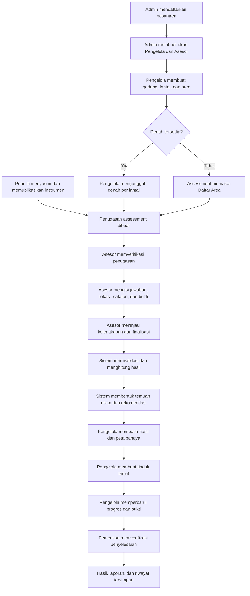

# Flow Penggunaan Web ISHAS

Dokumen ini menjelaskan urutan penggunaan prototipe ISHAS dari persiapan sistem sampai tindak lanjut hasil assessment. Flow mengikuti empat peran utama: **Admin**, **Peneliti**, **Asesor**, dan **Pengelola Pesantren**.

## Status Implementasi

- **Tersedia:** halaman dan interaksinya sudah dapat dicoba pada prototipe.
- **Simulasi dummy:** interaksi tersedia, tetapi data hanya contoh dan belum tersimpan ke backend.
- **Belum tersambung:** bentuk data atau kebutuhannya sudah dirancang, tetapi perpindahan data antarperan belum berjalan otomatis.
- **Menunggu keputusan:** aturan ilmiah atau kewenangannya belum boleh ditetapkan oleh frontend.

---

## 1. Flow Utama — Siklus Assessment K3L

Flow ini adalah gambaran paling penting dari penggunaan ISHAS.

### Urutan operasional utama

1. **Admin menyiapkan lembaga dan akun.**
   - Tambahkan pesantren.
   - Tambahkan akun Pengelola Pesantren.
   - Tambahkan akun Asesor dan tentukan lingkup lembaganya.
2. **Peneliti menyiapkan instrumen Published.**
   - Buat atau lanjutkan Draft.
   - Atur dimensi, indikator, kebutuhan lokasi, bukti, rubric, scoring, dan recommendation rule.
   - Validasi, lalu publikasikan versi instrumen.
3. **Pengelola menyiapkan master lokasi.**
   - Tambahkan gedung, lantai, dan area.
   - Unggah denah per lantai jika tersedia.
   - Tanpa denah, area tetap dapat dipilih oleh Asesor.
4. **Koordinator membuat penugasan assessment.**
   - Pilih pesantren, Asesor, periode, jadwal, kontak lapangan, dan versi instrumen Published.
   - **Bagian ini belum memiliki halaman pada prototipe.**
5. **Asesor melaksanakan assessment.**
   - Verifikasi data penugasan.
   - Isi indikator, lokasi observasi, catatan, dan bukti.
   - Tandai titik pada denah jika denah tersedia.
   - Simpan Draft, tinjau kelengkapan, lalu finalisasi.
6. **Sistem mengolah data final.**
   - Validasi data.
   - Jalankan scoring berdasarkan versi instrumen.
   - Bentuk hasil, temuan risiko, dan rekomendasi.
   - **Proses ini baru berupa data dummy dan kontrak backend.**
7. **Pengelola menggunakan hasil.**
   - Baca hasil assessment dan perbandingan periode.
   - Periksa temuan melalui Daftar Area, Denah Bangunan, atau Daftar Temuan.
   - Buat tindak lanjut, tentukan PIC dan tenggat, lalu unggah bukti penyelesaian.
8. **Penyelesaian diverifikasi dan dilaporkan.**
   - Pemeriksa menyetujui atau mengembalikan bukti.
   - Sistem menyimpan status, residual risk, laporan, dan audit trail.
   - **Pihak pemeriksa belum diputuskan.**

---

## 2. Flow Fondasi Sistem

### 2.1 Admin menambahkan pesantren

**Tujuan:** membuat lembaga yang akan dinilai.

1. Login sebagai **Admin**.
2. Buka **Pesantren**.
3. Pilih **Tambah pesantren**.
4. Isi nama, kode internal, kota/kabupaten, pengelola utama, dan alamat.
5. Simpan sebagai **Persiapan**.
6. Admin memverifikasi data dan mengubahnya menjadi **Aktif**.
7. Semua akun, lokasi, penugasan, dan assessment berikutnya harus memakai ID lembaga yang sama.

**Kondisi prototipe:** langkah 1–5 tersedia sebagai simulasi. Aksi verifikasi/aktivasi lembaga pada langkah 6 belum tersedia.

### 2.2 Admin membuat akun Pengelola Pesantren

1. Buka **Pengguna**.
2. Pilih **Tambah pengguna**.
3. Isi nama dan email.
4. Pilih peran **Pengelola Pesantren**.
5. Pilih lingkup pesantren yang dikelola.
6. Simpan dan kirim undangan.
7. Setelah akun aktif, Pengelola hanya dapat membuka data lembaga tersebut.

**Kondisi prototipe:** form tersedia sebagai simulasi, tetapi akun baru belum muncul pada daftar dan undangan belum benar-benar dikirim.

### 2.3 Admin membuat akun Asesor

1. Buka **Pengguna**.
2. Pilih **Tambah pengguna**.
3. Isi nama dan email Asesor.
4. Pilih peran **Asesor**.
5. Pilih lingkup lembaga atau wilayah yang boleh ditugaskan.
6. Simpan dan kirim undangan.
7. Setelah aktif, akun Asesor belum otomatis memiliki assessment; Asesor harus menerima penugasan terlebih dahulu.

**Catatan penting:** membuat akun Asesor berbeda dengan membuat penugasan assessment.

### 2.4 Admin meninjau hak akses

1. Buka **Hak Akses**.
2. Periksa matriks kewenangan Admin, Peneliti, Asesor, dan Pengelola Pesantren.
3. Pastikan rancangan hanya memberi akses minimum sesuai tugas pengguna.
4. Pada implementasi backend, perubahan kewenangan harus disimpan dan dicatat ke **Audit Log**.

**Kondisi prototipe:** matriks kewenangan hanya tersedia sebagai gambaran dan belum dapat diedit. Backend nantinya tetap wajib memeriksa role dan lingkup pada setiap permintaan.

---

## 3. Flow Instrumen oleh Peneliti

### 3.1 Membuat dan menyusun instrumen

1. Login sebagai **Peneliti**.
2. Buka **Instrumen**.
3. Pilih instrumen Draft atau buat instrumen baru.
4. Masuk ke **Instrument Builder**.
5. Tambahkan dimensi dan indikator.
6. Untuk setiap indikator, atur:
   - pertanyaan dan jenis jawaban;
   - opsi jawaban dan rubric;
   - bobot dummy;
   - kebutuhan bukti;
   - apakah lokasi observasi wajib;
   - sumber rujukan;
   - pemicu rekomendasi.
7. Simpan Draft dan periksa kelengkapannya.

### 3.2 Versioning dan publikasi

1. Buka **Versioning** untuk memeriksa Draft, Published, dan Archived.
2. Jika mengubah instrumen Published, buat versi baru dari snapshot versi tersebut.
3. Buka **Konfigurasi Scoring** dan lengkapi konfigurasi yang sudah disahkan.
4. Buka **Validasi & Publikasi**.
5. Selesaikan masalah validasi.
6. Publikasikan instrumen.
7. Versi Published dikunci dan harus digunakan secara utuh oleh assessment.

**Menunggu keputusan ilmiah:** bobot final, formula indeks, aturan N/A, ambang kategori risiko, serta recommendation rule resmi.

### 3.3 Data penelitian

1. Buka **Data Penelitian**.
2. Cari atau filter dataset.
3. Periksa metadata versi instrumen dan status verifikasi.
4. Import Excel/CSV atau ekspor data yang sudah dianonimkan.

**Kondisi prototipe:** tampilan dan validasi dummy tersedia. Penyimpanan, pemrosesan import, dan ekspor sebenarnya menunggu backend.

---

## 4. Flow Gedung, Area, dan Denah

### 4.1 Sumber data lokasi

| Data | Pembuat/pemilik | Digunakan oleh |
| --- | --- | --- |
| Pesantren | Admin | Seluruh peran sesuai lingkup |
| Gedung | Pengelola Pesantren | Asesor dan Pengelola |
| Lantai | Pengelola Pesantren | Asesor dan Pengelola |
| Area | Pengelola Pesantren | Referensi utama lokasi observasi |
| Denah lantai | Pengelola Pesantren | Penempatan titik dan visualisasi temuan |
| Titik temuan | Asesor | Peta Bahaya & Risiko |

Denah **bukan** dibuat otomatis oleh ISHAS dan **bukan** sumber nilai risiko. Denah berasal dari lembaga, sedangkan risiko berasal dari jawaban/bukti assessment serta aturan ilmiah instrumen.

### 4.2 Pengelola menambahkan gedung

1. Login sebagai **Pengelola Pesantren**.
2. Buka **Gedung & Denah**.
3. Pilih **Tambah gedung**.
4. Isi nama dan kode gedung.
5. Simpan gedung.
6. Sistem membuat lantai awal tanpa denah.

### 4.3 Pengelola menambahkan lantai dan area

1. Pilih gedung pada daftar gedung.
2. Pilih **Tambah lantai** dan isi nama lantai.
3. Pada lantai terkait, pilih **Tambah area**.
4. Isi nama area dan zona/blok.
5. Simpan area.
6. Area langsung menjadi referensi lokasi yang dapat dipilih Asesor setelah data tersambung ke backend.

**Aturan utama:** area wajib tersedia untuk indikator yang membutuhkan lokasi; denah tetap opsional.

### 4.4 Pengelola mengunggah denah

1. Pilih gedung dan lantai.
2. Pilih **Unggah denah**.
3. Pilih JPG, PNG, atau PDF milik pesantren.
4. Sistem menyimpan file sebagai versi denah baru.
5. Unggahan berikutnya tidak menimpa versi lama.
6. Assessment historis tetap mengacu pada versi denah yang digunakan saat observasi.

**Kondisi prototipe:** nama file dan versi dapat disimulasikan. Isi file unggahan belum dirender sebagai gambar denah sebenarnya.

### 4.5 Jika pesantren tidak memiliki denah

1. Pengelola tetap membuat gedung, lantai, dan area.
2. Asesor memilih area tanpa menandai koordinat.
3. Temuan tampil melalui **Daftar Area** dan **Daftar Temuan**.
4. Jika denah ditambahkan kemudian, data lama tetap tidak boleh diberi koordinat buatan tanpa observasi atau koreksi teraudit.

---

## 5. Flow Penugasan Assessment

### 5.1 Flow yang dibutuhkan

1. Pengguna berwenang membuka **Manajemen Penugasan**.
2. Pilih pesantren berstatus Aktif.
3. Pilih Asesor yang aktif dan memiliki lingkup yang sesuai.
4. Pilih versi instrumen Published.
5. Tentukan periode, tanggal, dan kontak pendamping lapangan.
6. Simpan sebagai **Terjadwal**.
7. Asesor menerima notifikasi.
8. Penugasan muncul pada **Assessment Saya** dan **Assessment Baru** milik Asesor tersebut.

**Kondisi prototipe:** Asesor sudah memiliki daftar penugasan dummy, tetapi belum ada halaman untuk membuat, mengubah, membatalkan, atau memindahkan penugasan. Peran pembuat penugasan juga belum ditetapkan secara resmi.

---

## 6. Flow Assessment oleh Asesor

### 6.1 Memulai assessment

1. Login sebagai **Asesor**.
2. Buka **Assessment Baru** atau **Assessment Saya**.
3. Pilih penugasan berstatus **Terjadwal**.
4. Verifikasi identitas pesantren, kontak lapangan, periode/tanggal, dan versi instrumen.
5. Setelah empat pemeriksaan lengkap, pilih **Mulai isi assessment**.

Asesor tidak boleh membuat assessment untuk lembaga yang tidak tercantum dalam penugasannya.

### 6.2 Mengisi indikator umum

1. Pilih dimensi dan indikator.
2. Isi jawaban.
3. Tambahkan catatan observasi.
4. Jika memilih N/A, isi alasan.
5. Unggah foto atau dokumen jika bukti diwajibkan.
6. Simpan Draft dan lanjutkan ke indikator berikutnya.

### 6.3 Mengisi indikator yang membutuhkan lokasi

1. Pada bagian **Lokasi observasi**, pilih gedung, lantai, dan area dari master pesantren.
2. Jika denah tersedia, pilih **Tandai pada denah**.
3. Sentuh/klik posisi temuan untuk menyimpan koordinat relatif X dan Y.
4. Jika tidak membutuhkan titik yang presisi, pilih **Simpan tanpa titik**.
5. Lengkapi jawaban, catatan, dan bukti indikator.

Area adalah referensi lokasi utama. Koordinat hanya pelengkap visual.

### 6.4 Meninjau dan finalisasi

1. Pilih **Tinjau**.
2. Periksa empat kelompok kelengkapan:
   - jawaban wajib;
   - bukti wajib;
   - catatan untuk N/A;
   - lokasi observasi.
3. Pilih item yang bermasalah untuk kembali ke indikatornya.
4. Setelah lengkap, pilih **Finalisasi assessment**.
5. Konfirmasi penguncian.
6. Assessment menjadi hanya-baca dan tetap terhubung ke versi instrumen yang digunakan.

**Kondisi prototipe:** data hanya tersimpan selama halaman terbuka. Finalisasi belum memperbarui dashboard Pengelola secara otomatis.

### 6.5 Bukti dan riwayat

- **Bukti Lapangan:** memeriksa file yang lengkap atau masih wajib dilengkapi.
- **Riwayat:** membuka assessment lama dan metadata versinya secara hanya-baca.

---

## 7. Flow Pengolahan Hasil oleh Sistem

Flow ini dijalankan backend setelah assessment lengkap.

1. Validasi jawaban, bukti, lokasi, status penugasan, dan versi instrumen.
2. Kunci assessment secara atomik.
3. Hitung skor indikator dan dimensi memakai konfigurasi versi instrumen.
4. Hitung indeks dan kategori K3L.
5. Bentuk `RiskObservation` untuk temuan yang memenuhi rule.
6. Hubungkan temuan ke assessment, indikator, bukti, area, koordinat opsional, dan versi denah.
7. Jalankan recommendation rule.
8. Simpan hasil, temuan, rekomendasi, dan audit event.
9. Beri notifikasi kepada Pengelola Pesantren.

**Kondisi prototipe:** hasil yang terlihat masih data ilustratif. Formula dan ambang final belum tersedia dari penelitian.

---

## 8. Flow Penggunaan Hasil oleh Pengelola

### 8.1 Membaca hasil assessment

1. Login sebagai **Pengelola Pesantren**.
2. Buka **Hasil Assessment**.
3. Pilih periode atau assessment Final.
4. Periksa skor total, kategori, skor per dimensi, dan perbandingan periode.
5. Telusuri versi instrumen yang menghasilkan skor tersebut.

### 8.2 Membaca Peta Bahaya & Risiko

1. Buka **Peta Bahaya & Risiko**.
2. Pilih assessment, gedung, lantai, tingkat risiko, atau status pekerjaan.
3. Pilih salah satu tampilan:
   - **Daftar Area:** tampilan utama dan tetap tersedia tanpa denah;
   - **Denah Bangunan:** menampilkan marker bahaya jika denah tersedia;
   - **Daftar Temuan:** fokus pada daftar seluruh temuan dan filternya.
4. Buka detail temuan.
5. Periksa bahaya, dampak, kemungkinan, keparahan, paparan, pengendalian, dan residual risk.
6. Periksa sumber assessment, indikator, bukti, serta versi denah.
7. Buka rekomendasi atau tindak lanjut yang tepat dari temuan tersebut.

Peta hanya menampilkan **temuan bahaya**. Area tanpa temuan aktif ditampilkan netral, bukan sebagai marker risiko hijau.

### 8.3 Membuat tindak lanjut

1. Buka **Rekomendasi** atau masuk dari detail temuan.
2. Pilih rekomendasi berstatus **Belum ditindaklanjuti**.
3. Pilih **Buat rencana tindakan**.
4. Tentukan PIC, tenggat, dan catatan rencana.
5. Mulai tindak lanjut.
6. Buka **Tindak Lanjut**.
7. Perbarui catatan dan progres pekerjaan.
8. Unggah bukti penyelesaian.
9. Ajukan verifikasi.

### 8.4 Verifikasi dan risiko tersisa

1. Pemeriksa membuka pekerjaan **Menunggu verifikasi**.
2. Periksa bukti dan kondisi lapangan.
3. Setujui atau kembalikan pekerjaan dengan catatan.
4. Jika disetujui, status menjadi **Terverifikasi**.
5. Jika dibutuhkan, lakukan penilaian residual risk tanpa menimpa nilai risiko awal.

**Menunggu keputusan:** siapa pemeriksanya, apakah Asesor/Tim K3/Admin, dan kapan residual risk harus dinilai ulang.

### 8.5 Laporan

1. Buka **Laporan**.
2. Pilih assessment atau periode.
3. Periksa ringkasan pimpinan dan metadata versi instrumen.
4. Buat atau unduh PDF/Excel.
5. Laporan menyimpan periode, versi instrumen, waktu pembuatan, dan pembuatnya.

---

## 9. Flow Pendukung yang Dikelompokkan per Peran

### Admin

- **Dashboard Sistem:** memantau jumlah pengguna, lembaga, assessment, dan aktivitas terbaru.
- **Pengguna:** mencari, memfilter, membuat, dan melihat akun.
- **Pesantren:** mengelola profil dan status onboarding lembaga.
- **Hak Akses:** memeriksa kewenangan per role.
- **Audit Log:** menelusuri perubahan akun, akses, pengaturan, publish, dan finalisasi.
- **Pengaturan:** mengelola identitas aplikasi, zona waktu, sesi, notifikasi, dan maintenance.

### Peneliti

- **Dashboard Penelitian:** melihat kesiapan versi, indikator, dan masalah validasi.
- **Instrumen:** menyusun isi instrumen.
- **Versioning:** membuat versi baru tanpa merusak hasil lama.
- **Konfigurasi Scoring:** memasukkan parameter ilmiah yang telah disahkan.
- **Validasi & Publikasi:** memeriksa kelengkapan dan mengunci versi.
- **Data Penelitian:** memeriksa, mengimpor, memverifikasi, dan mengekspor dataset.

### Asesor

- **Dashboard Asesor:** melihat prioritas penugasan dan kekurangan bukti.
- **Assessment Saya:** melanjutkan Draft atau membuka ringkasan Final.
- **Assessment Baru:** memulai penugasan Terjadwal.
- **Bukti Lapangan:** mengelola kelengkapan bukti.
- **Riwayat:** menelusuri assessment yang pernah dilakukan.

### Pengelola Pesantren

- **Ringkasan K3L:** melihat kondisi lembaga, tren, prioritas, dan progres tindak lanjut.
- **Hasil Assessment:** membaca hasil per periode dan per dimensi.
- **Gedung & Denah:** mengelola master lokasi dan denah.
- **Peta Bahaya & Risiko:** menelusuri temuan dan sumbernya.
- **Rekomendasi:** menerjemahkan rekomendasi menjadi pekerjaan.
- **Tindak Lanjut:** mengelola progres dan bukti penyelesaian.
- **Laporan:** menghasilkan keluaran untuk pimpinan.

### Flow bersama

1. Pengguna login dengan akun sesuai peran.
2. Sistem memulihkan sesi, role, permission, dan lingkup data.
3. Pengguna hanya melihat menu sesuai perannya.
4. Notifikasi membuka halaman yang relevan pada ruang kerja pengguna.
5. Akun aktif selalu terlihat di kanan atas.
6. Pergantian peran dilakukan dengan logout lalu login menggunakan akun lain.

---

## 10. Evaluasi Masalah dan Kekurangan Flow

### Prioritas sangat tinggi — harus diselesaikan sebelum backend

1. **Belum ada Manajemen Penugasan.**
   - Asesor hanya dapat memilih penugasan yang sudah ada.
   - Belum ada pihak yang dapat memilih pesantren, Asesor, versi instrumen, periode, dan jadwal.
   - Kontrak `IshasApi` juga baru memiliki daftar dan mulai penugasan, belum memiliki operasi membuat/mengubah penugasan.
   - **Rekomendasi:** tambahkan modul Penugasan pada Admin atau role Koordinator Assessment setelah kewenangannya disetujui.

2. **Data antarperan pada prototipe belum menjadi satu sumber.**
   - Gedung/area yang dibuat Pengelola tidak otomatis muncul pada form Asesor.
   - Akun dan pesantren baru juga belum masuk ke daftar setelah form disimpan.
   - **Rekomendasi:** buat satu mock repository/store bersama sebelum API backend agar flow ujung-ke-ujung bisa diuji sekarang.

3. **Finalisasi assessment belum mengubah hasil Pengelola.**
   - Hasil, temuan peta, dan rekomendasi masih kumpulan data dummy terpisah.
   - **Rekomendasi:** buat simulasi processing state setelah finalisasi dan hasilkan data mock yang bisa dibuka Pengelola.

### Prioritas tinggi — diperlukan agar flow tidak membingungkan

4. **Onboarding pesantren belum lengkap.**
   - Form menghasilkan status Persiapan, tetapi belum ada aksi verifikasi, aktivasi, atau hubungan langsung ke akun Pengelola.

5. **File denah belum menjadi denah yang benar-benar digunakan.**
   - Prototipe menyimpan nama dan versi file, tetapi tampilan denah masih berupa ilustrasi antarmuka.
   - Area baru juga belum dapat digambar/diposisikan di atas file denah yang diunggah.

6. **Hubungan instrumen Published ke penugasan belum terlihat.**
   - Peneliti dapat publish dan Asesor melihat versi pada tugas, tetapi tidak ada langkah UI yang menghubungkan keduanya.

7. **Lifecycle Submit dan Final belum diputuskan.**
   - Prototipe langsung melakukan finalisasi.
   - Kontrak backend menyediakan Submit dan Finalize, sehingga perlu diputuskan apakah ada reviewer di antaranya.

8. **Pemeriksa tindak lanjut dan denah belum ditentukan.**
   - UI memakai istilah “Pemeriksa”, tetapi belum ada role atau inbox verifikasi khusus.

9. **Flow koreksi data final belum tersedia.**
   - Sistem menyebut koreksi harus teraudit, tetapi belum ada halaman pengajuan koreksi, persetujuan, atau alasan perubahan.

### Prioritas menengah — meningkatkan kesiapan implementasi

10. **Navigasi belum berbasis URL per halaman.**
    - Menu saat ini berpindah melalui state antarmuka.
    - Refresh, tombol Back browser, bookmark, dan tautan langsung ke detail belum menjadi flow nyata.
    - **Rekomendasi:** sebelum integrasi backend, tetapkan struktur route untuk setiap role dan detail entity.

11. **Audit Log dan notifikasi belum mengikuti aksi dummy.**
    - Pesan sukses menyebut audit, tetapi daftar audit/notifikasi tidak berubah secara langsung.

12. **Belum ada pengelolaan penuh master lokasi.**
    - Tambah gedung/lantai/area tersedia, tetapi edit, arsip, penggabungan area, validasi duplikasi, dan dampak perubahan terhadap riwayat belum tersedia.

13. **Residual risk baru ditampilkan, belum memiliki flow penilaian ulang.**
    - Perlu ditentukan siapa yang menilai ulang, instrumen apa yang dipakai, dan apakah memerlukan kunjungan Asesor baru.

14. **Wadah grafik kadang belum memiliki ukuran saat grafik dirender.**
    - Sesi pengembangan mencatat peringatan lebar/tinggi negatif dari komponen grafik.
    - Halaman tetap dapat dibuka, tetapi grafik berpotensi berkedip atau kosong ketika ruang kerja/ukuran layar berubah.
    - **Rekomendasi:** beri ukuran minimum pada wadah grafik dan render grafik hanya setelah panelnya terlihat.

### Hal yang wajar belum final pada fase prototipe

- Data belum persisten dan unggahan belum masuk object storage.
- Email undangan belum dikirim.
- PDF/Excel belum benar-benar dihasilkan.
- Scoring dan kategori risiko masih ilustratif.
- Loading/error/conflict dari API belum dapat diuji dengan backend nyata.
- Sensor/IoT dan integrasi eksternal belum menjadi prioritas 2026.

---

## 11. Urutan Perbaikan yang Disarankan

1. Tetapkan pemilik **Manajemen Penugasan**.
2. Buat flow onboarding pesantren sampai akun Pengelola aktif.
3. Satukan seluruh data dummy lintas peran dalam satu mock repository.
4. Hubungkan lokasi Pengelola ke assessment Asesor.
5. Hubungkan finalisasi Asesor ke hasil, peta bahaya, dan rekomendasi Pengelola.
6. Render file denah sebenarnya dan sediakan penempatan area di atas denah.
7. Tetapkan workflow Submit/Review/Final dan pemeriksa tindak lanjut.
8. Tetapkan route URL sebelum mengganti mock adapter dengan backend.

---

## 12. Ringkasan Ulang Flow Utama

Bagian ini sengaja menulis ulang flow utama sebagai checklist singkat untuk demo, pengujian, dan pembahasan dengan dosen.

- [ ] **Admin:** daftarkan dan aktifkan pesantren.
- [ ] **Admin:** buat akun Pengelola dan Asesor dengan lingkup yang benar.
- [ ] **Peneliti:** susun, validasi, dan publish versi instrumen.
- [ ] **Pengelola:** tambahkan gedung, lantai, dan area.
- [ ] **Pengelola:** unggah denah jika tersedia; jika tidak, gunakan Daftar Area.
- [ ] **Koordinator/Admin:** buat penugasan yang menghubungkan pesantren, Asesor, periode, dan instrumen Published.
- [ ] **Asesor:** verifikasi penugasan dan mulai assessment.
- [ ] **Asesor:** isi jawaban, lokasi, titik opsional, catatan, dan bukti.
- [ ] **Asesor:** tinjau kelengkapan dan finalisasi.
- [ ] **Sistem:** validasi, scoring, bentuk hasil, temuan risiko, dan rekomendasi.
- [ ] **Pengelola:** baca hasil serta telusuri Peta Bahaya & Risiko.
- [ ] **Pengelola:** buat tindakan, tentukan PIC/tenggat, perbarui progres, dan unggah bukti.
- [ ] **Pemeriksa:** verifikasi penyelesaian dan residual risk bila diperlukan.
- [ ] **Sistem/Pengelola:** hasilkan laporan dan pertahankan riwayat serta audit trail.

Flow utama baru benar-benar tersambung ketika satu data yang dibuat pada langkah awal dapat dipakai oleh peran berikutnya tanpa dibuat ulang sebagai data dummy terpisah.
